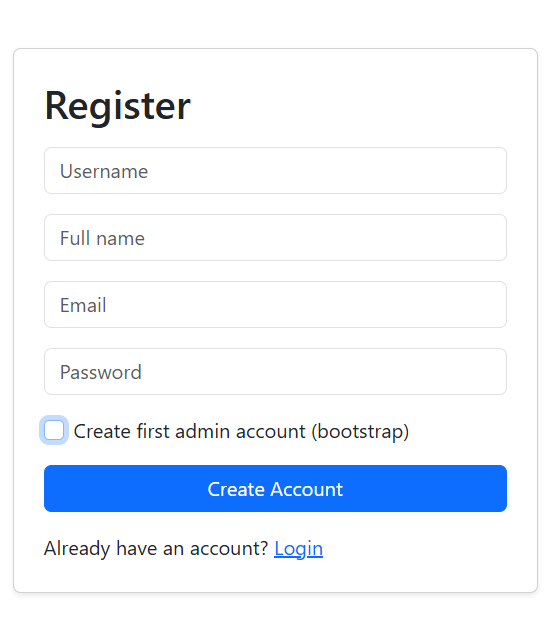
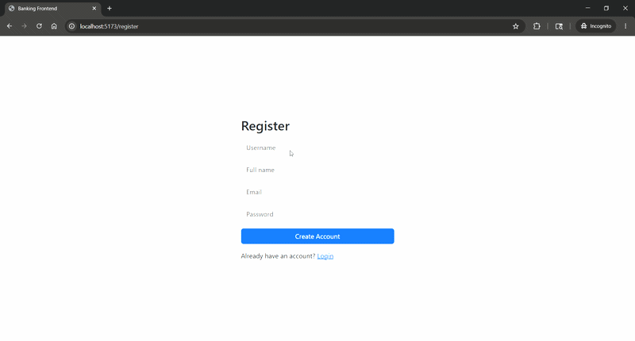
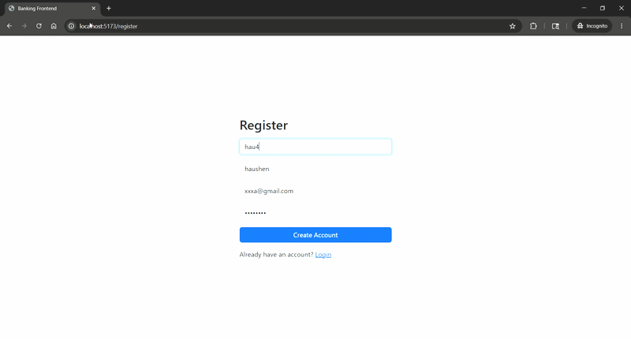
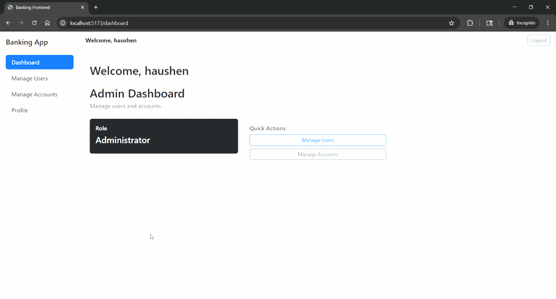
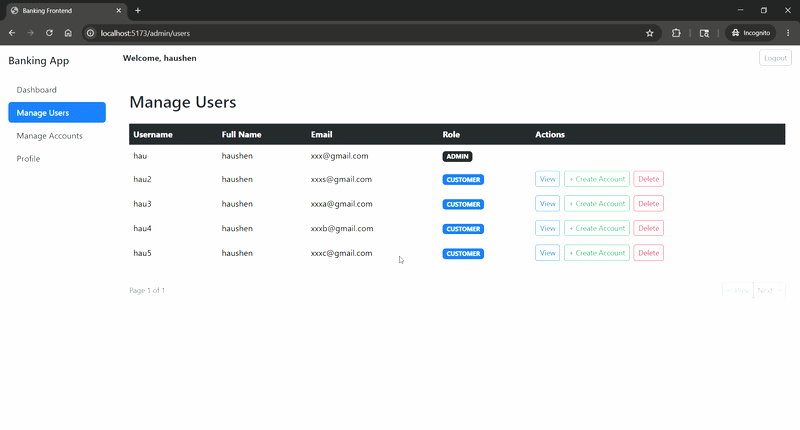
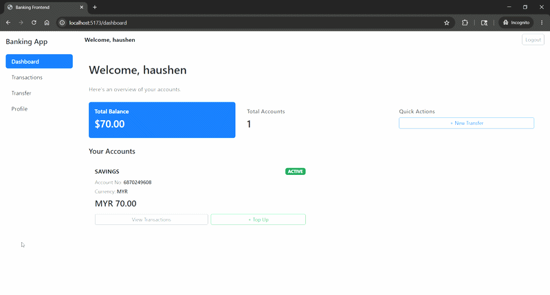

# 🏦 Banking App

A full-stack banking simulator built with **Java Spring Boot** and **React**, featuring JWT
authentication, role-based access control, fund transfers, and an admin management panel.


---

## 🎬 Demo

### 🔐 Bootstrap — Register First Admin
> First-time setup: register the first admin account when no admin exists.



---

### 👤 Register as Customer
> New users can self-register as a customer.



---

### ⚠️ Username & Email Validation
> System rejects duplicate usernames and emails with clear error messages.



---

### 🏧 Admin — Create Account for Customer
> Admin can create bank accounts and assign them to customers.



---

### 🛠️ Admin — Manage Customers & Accounts
> Admin panel for managing all users and accounts, including status updates.



---

### 💸 Customer — Top Up, Transfer & Transactions
> Customers can top up balance, transfer funds, and view transaction history.



---

## 🚀 Tech Stack

### Backend
| Technology | Purpose |
|---|---|
| Java 21 + Spring Boot 3.4.5 | REST API framework |
| Spring Security + JWT | Authentication & authorization |
| Spring Data JPA + Hibernate | ORM & database access |
| PostgreSQL | Relational database |
| Flyway | Database schema migrations |
| Lombok | Boilerplate reduction |
| JUnit 5 + Mockito | Unit testing |

### Frontend
| Technology | Purpose |
|---|---|
| React 18 + Vite | UI framework & build tool |
| TanStack React Query | Server state management |
| React Hook Form | Form handling |
| React Router v6 | Client-side routing |
| Axios | HTTP client |
| Bootstrap 5 | Styling |

### DevOps
| Technology | Purpose |
|---|---|
| Docker Compose | PostgreSQL containerization |

---

## ✨ Features

### 👤 Customer
- Register & login with JWT authentication
- View dashboard with account summary
- Create bank accounts (Savings / Current)
- Transfer funds between accounts with **idempotency protection** (no double transfers)
- View transaction history
- Update profile

### 🛡️ Admin
- Manage all users — view, update role, delete
- Manage all accounts — view, update status, delete
- View individual user details and their linked accounts

---

## ⚙️ Getting Started

### Prerequisites
- Java 21+
- Node.js 18+
- Docker Desktop

### 1. Clone the repository
```bash
git clone https://github.com/HauShen/Banking-app.git
cd Banking-app
```

### 2. Start PostgreSQL with Docker
```bash
docker compose up -d
```

### 3. Configure environment
Edit `src/main/resources/application.properties`:
```properties
spring.datasource.url=jdbc:postgresql://localhost:5432/banking_db
spring.datasource.username=hau
spring.datasource.password=abc123
security.jwt.secret=<your-base64-secret>
security.jwt.expiration=86400000
bootstrap.admin.enabled=true
```

### 4. Run the backend
```bash
./gradlew bootRun
```
Backend runs on `http://localhost:8080`

### 5. Run the frontend
```bash
cd src/frontend
cp .env.example .env
npm install
npm run dev
```
Frontend runs on `http://localhost:5173`

---

## 🔐 API Endpoints

All protected endpoints require:
```
Authorization: Bearer <your-jwt-token>
```

| Method | Endpoint | Access | Description |
|---|---|---|---|
| POST | `/api/auth/register` | Public | Register new user |
| POST | `/api/auth/login` | Public | Login & get JWT |
| GET | `/api/auth/bootstrap-status` | Public | Check bootstrap status |
| POST | `/api/auth/bootstrap-admin/register` | Public* | Register first admin |
| GET | `/api/users/get-by-username/{username}` | JWT | Get user profile |
| PUT | `/api/users/{id}` | JWT | Update profile |
| GET | `/api/users/admin/get_all` | ADMIN | List all users |
| PATCH | `/api/users/{id}/role` | ADMIN | Update user role |
| DELETE | `/api/users/{id}` | ADMIN | Delete user |
| POST | `/api/accounts/create` | JWT | Create bank account |
| GET | `/api/accounts/get_all/{user_id}` | JWT | Get user's accounts |
| GET | `/api/accounts/{id}` | JWT | Get account by ID |
| PATCH | `/api/accounts/{id}/status` | ADMIN | Update account status |
| DELETE | `/api/accounts/{id}` | ADMIN | Delete account |
| POST | `/api/transfers` | JWT | Transfer funds |
| GET | `/api/transfers/{reference}` | JWT | Get transaction by reference |

> \* Bootstrap endpoint auto-disables once the first admin is created.


---

## 🧪 Running Tests

```bash
./gradlew test
```

| Test Class | What It Covers |
|---|---|
| `UserProfileServiceImplTest` | Registration, role management, CRUD |
| `AccountServiceImplTest` | Account creation, status updates, CRUD |
| `TransactionServiceImplTest` | Fund transfers, idempotency, error handling |
| `AuthServiceTest` | JWT registration, login, bad credentials |
| `BootstrapServiceImplTest` | Admin bootstrap flow and guards |
